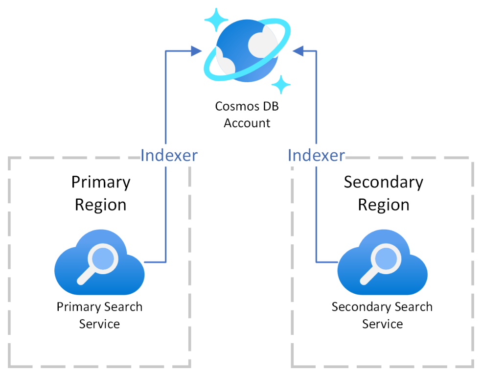
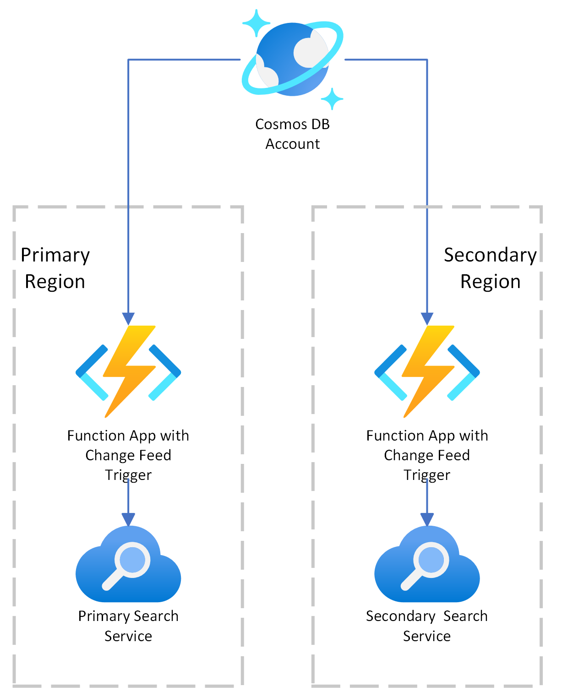
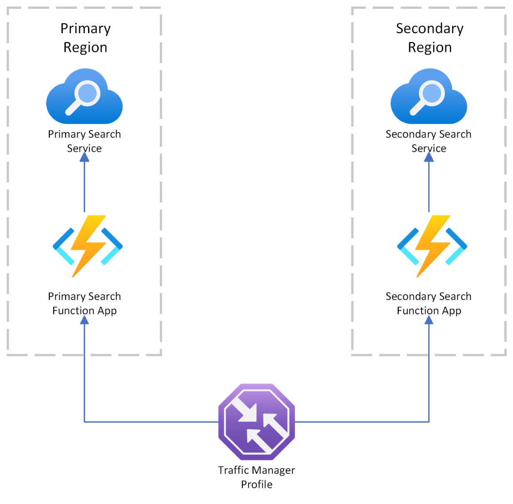

# Multi-region deployment of Azure Cognitive Search for business continuity

This repository contains templates that deploy Azure Cognitive Search across multiple regions. There are three patterns to help get you started. Choose the one that best satisfies your business continuity and disaster recovery requirements for Azure Cognitive Search workloads.

The sample uses the [Azure CLI](https://learn.microsoft.com/cli/azure/) and [Bicep](https://learn.microsoft.com/azure/azure-resource-manager/bicep/overview?tabs=bicep).

All of the templates create two billable [Azure Cognitive Search](https://learn.microsoft.com/azure/search/search-create-service-portal) resources, same tier and configuration, in different regions. You can't use the free tier for this scenario. The assumption is you'll use one of the search services as a primary instance to handle all of your indexing and query workloads. The second search service exists as a copy of the first. Each option varies on how it provides synchronization between the search resources.

## Three options for business continuity and disaster recovery

**Option 1** provides Azure Cognitive Search (2), each configured to run under a managed identity, with [Azure Cosmos DB NoSQL](https://learn.microsoft.com/azure/cosmos-db/try-free?tabs=nosql). Each search resource is created with identical indexers, data sources, and indexes. Both indexers run every 5 minutes on a schedule to synchronize the indexes. Both data sources connect to the same Cosmos database.

**Option 2** also uses Cosmos DB NoSQL, but doesn't assume indexer-driven indexing. Instead, this approach relies on a [Cosmos DB change feed](https://learn.microsoft.com/azure/cosmos-db/change-feed) and [Azure functions](https://learn.microsoft.com/azure/cosmos-db/nosql/change-feed-functions). Updates to a Cosmos DB container are written to a change feed. Azure Functions provide the connection to the change feed. The functions are automatically triggered on each new event in the Azure Cosmos DB container's change feed.

**Option 3** is the same as the second option, but includes [Azure Traffic Manager](https://learn.microsoft.com/azure/traffic-manager/) for request redirection.

## Prerequisites

+ [Azure subscription](https://azure.microsoft.com/free/)
+ [Azure CLI](https://learn.microsoft.com/cli/azure/install-azure-cli)
+ Permission to create and access resources in Azure

## Sample set up

1. Install the [Azure CLI](https://learn.microsoft.com/cli/azure/install-azure-cli) or another supported tool for Bicep deployment.

1. Clone or download this sample repository.

1. Extract contents if the download is a zip file. Make sure the files are read-write.

1. Sign in to your Azure account:

   `az login`

1. If you have multiple Azure subscriptions, list them and get the subscription ID of the one you want to use.

   ```azurecli
   az account show
   ```

1. Set it to the correct subscription ID:

   ```azurecli
    az account set --subscription <YOUR-SUBSCRIPTION-ID>
   ```

1. Create a resource group to contain all of the resources. If you're deploying and comparing more than one option, create a separate resource group for each one.

   ```azurecli
   az group create --name demoResourceGroup --location westus
   ```

## Run the sample

In Azure Cognitive Search, indexing is achieved through push APIs that upload JSON documents into search, or through pull APIs that use indexers to retrieve and serialize documents from supported data sources. Both approaches are widely used. For this reason, business continuity is demonstrated for both approaches. The first option uses indexers to pull in data from Cosmos DB NoSQL. The second option pushes JSON documents from Cosmos DB into a search.

You only need to run one version. Each one creates a Cosmos DB account and two search services.

### Option 1: Cosmos DB indexer synchronization

Import data from Cosmos DB NoSQL automatically to multiple search services using [indexers](https://learn.microsoft.com/azure/search/search-howto-index-cosmosdb). This approach is based on having nearly identical data on two instances of Cognitive Search.

For synchronization, this sample uses scheduled [indexers to pull data into a search index](https://learn.microsoft.com/azure/search/search-what-is-data-import#pulling-data-into-an-index). On each search service, the indexers run at 5 minute intervals, and both data sources point to the same [Cosmos DB Account](https://learn.microsoft.com/azure/cosmos-db/resource-model) and database. A 5-minute interval is considered the minimum for indexer schedules. If you require more frequent synchronization, consider another option.



1. From the command line tool, navigate to the `bicep` directory in the sample. If you're using Windows, the folder path might be `C:\Users\<USER-NAME>\azure-search-multiple-regions\bicep>`.

1. Optionally, review the bicep file (cosmosdb-indexer-sync.bicep) or parameters file (cosmosdb-indexer-sync.parameters.json). Feel free to change attributes, such as the primary or secondary regions, or the resource names.

1. Run the next CLI command to create the Cosmos DB account, database, and search resources:

   ```azurecli
   az deployment group create --resource-group <YOUR-RESOURCE-GROUP> --template-file cosmosdb-indexer-sync.bicep --mode Incremental --parameters @cosmosdb-indexer-sync.parameters.json
   ```

It takes several minutes to deploy all of the resources.

Indexers are configured to use the built-in ToDo sample database. To test the deployment, add a few items to the built-in sample ToDo database on Cosmos DB. Wait for five minutes, and then check the indexes in both search services. You should see the same content in both.

### Option 2: Cosmos DB change feed synchronization

Import data from Cosmos DB NoSQL automatically to multiple search services using [change feed and Azure Functions](https://learn.microsoft.com/azure/cosmos-db/nosql/change-feed-functions). This allows multiple instances of applications backed by separate search services to receive Cosmos DB changes quickly and stay in sync. This sample uses a [push-based sync architecture](https://learn.microsoft.com/azure/search/search-what-is-data-import#pushing-data-to-an-index) to populate the search indexes.



1. Create a new resource group in your Azure subscription.

1. Navigate to the `bicep` directory in the sample. You'll use the cosmosdb-changefeed-sync Bicep and parameters file. Edit these files to change application attributes such as the primary or secondary regions it is deployed in.

1. Run the following CLI command:

   ```azurecli
   az deployment group create --resource-group <your-resource-group> --template-file cosmosdb-changefeed-sync.bicep --mode Incremental --parameters @cosmosdb-changefeed-sync.parameters.json
   ```

Two instances of Cognitive Search are deployed, automatically syncing to a [Cosmos DB Account](https://learn.microsoft.com/azure/cosmos-db/resource-model) using [change feed](https://learn.microsoft.com/azure/cosmos-db/nosql/change-feed-functions).

To test the deployment, add a few items to the built-in sample ToDo database on Cosmos DB. Unlike the indexer-based approach,there is no minimum interval. You can check the indexes in both search services. You should see the same content in both.

### Option 3: Use Traffic Manager

Use [Azure Traffic Manager](https://learn.microsoft.com/azure/traffic-manager/) to automatically fail over between search services if one of them encounters an issue.

This option creates a traffic manager profile.



1. Create a new resource group in your Azure subscription.

1. Navigate to the `bicep` directory in the sample. You'll use the search-trafficmanager Bicep and parameters file. Edit these files to change application attributes such as the primary or secondary regions it is deployed in.

1. Run the following CLI command:

   ```azurecli
   az deployment group create --resource-group <your-resource-group> --template-file search-trafficmanager.bicep --mode Incremental --parameters @search-trafficmanager.parameters.json
   ```

Two instances of a search application are deployed behind a Traffic Manager Profile.

## Sample clean up

This sample creates multiple Azure resources, several of which are billable. After completing this exercise, delete any resources you no longer need.

1. Sign in to the Azure portal.

1. To delete all of the resources, find and delete the resource groups that you created.

## Resources

+ [Azure Cognitive Search documentation](https://learn.microsoft.com/azure/search/)
+ [Samples browser on Microsoft Learn](https://learn.microsoft.com/samples/browse/)
+ [Training](https://learn.microsoft.com/training/)